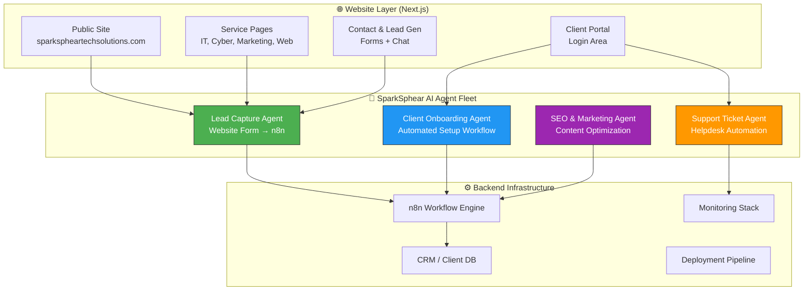
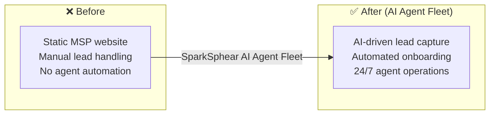

# SparkSphear Tech Solutions

> **AI-Powered MSP & Digital Agency — Your Vision, Structured to Scale.**

---

## ❌ The Problem

Small to mid-sized businesses need IT support, cybersecurity, and digital marketing — but they can't afford enterprise agencies and don't have in-house expertise. They end up juggling 3-4 vendors (MSP, web developer, SEO agency, marketing firm) who don't talk to each other. Service delivery is reactive: something breaks → someone calls → hours or days to fix.

**Before:** 3-4 disconnected vendors, reactive break-fix IT, no unified strategy, slow service delivery, no AI automation, business owners become de facto IT managers.

**After (AI Agent Fleet):** A single AI-powered MSP + Digital Agency with automated lead capture, client onboarding, helpdesk ticketing, and SEO optimization — all orchestrated by agents. Proactive monitoring instead of reactive firefighting.

---

## 🧠 AI Agent Architecture



## 🔄 Before vs After



---

**Your Vision, Structured to Scale.**

SparkSphear Tech Solutions is a premier Managed Service Provider (MSP) and Digital Agency serving the area. We empower small to mid-sized businesses by bridging the gap between complex technology and real-world business growth.

## 🚀 Our Services

We provide a comprehensive suite of services designed to be your single point of contact for all things tech:

* **Managed IT Services**: 24/7 monitoring, helpdesk support, and infrastructure management. We keep your systems running so you can focus on your business.
* **Cybersecurity**: Enterprise-grade protection tailored for SMBs. Compliance audits, network security, and data protection.
* **Digital Marketing & SEO**: Data-driven strategies to increase your online visibility and drive local traffic.
* **Web Design & Development**: High-performance, mobile-responsive websites that convert visitors into customers.
* **Technology Consulting**: Strategic planning to ensure your technology investment delivers ROI.

---

## 💻 Developer / Deployment Guide

This repository contains the source code for the SparkSphear marketing website. It is built with modern web technologies for speed, SEO, and visual fidelity.

### Tech Stack
- **Framework**: Next.js 14 (App Router)
- **Styling**: Tailwind CSS + Custom Design System
- **Animation**: Framer Motion
- **Deployment**: Static Export (Ready for GitHub Pages / Netlify / Vercel)

### Quick Start (Local Development)
1. **Install Node.js** (Required).
2. **Install Dependencies**:
 ```bash
 npm install
 ```
3. **Run Development Server**:
 ```bash
 npm run dev
 ```
 Visit `http://localhost:3000`.

### Production Build
To generate the static site for deployment:
```bash
npm run build
```
This generates the `out/` folder, which can be uploaded to any static hosting provider.
